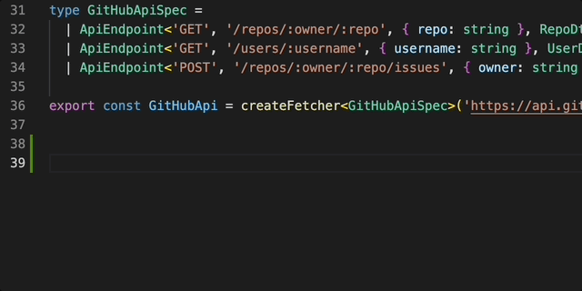
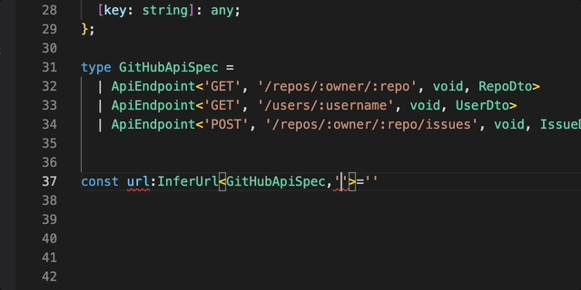
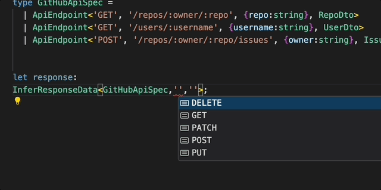

# TypeScript API Docs

이 저장소는 TypeScript에서 타입 안전한 API fetcher를 생성하고 사용하는 방법에 대한 예제를 제공합니다. 자세한 설명과 블로그 게시물을 보려면 [블로그](https://cgoinglove.github.io/post/%EA%B0%95%EB%A0%A5%ED%95%9C-%ED%83%80%EC%9E%85-%EC%B6%94%EB%A1%A0%EC%9D%84-%ED%99%9C%EC%9A%A9%ED%95%9C-api-%EC%9E%91%EC%84%B1-%ED%8C%A8%ED%84%B4)를 방문하세요.

## 개요

이 프로젝트는 [JSONPlaceholder](https://jsonplaceholder.typicode.com/)와 [GitHub API](https://docs.github.com/ko/rest/using-the-rest-api/getting-started-with-the-rest-api?apiVersion=2022-11-28)와 같은 다양한 서비스에 대한 API fetcher를 TypeScript로 생성하는 예제를 포함합니다. 이 fetcher들은 타입 안전성을 보장하고, API와 상호 작용하는 깔끔하고 유지보수 가능한 방법을 제공합니다.

```typescript
type GitHubApiSpec =
  | ApiEndpoint<'GET', '/repos/:owner/:repo', { repo: string }, RepoDto>
  | ApiEndpoint<'GET', '/users/:username', { username: string }, UserDto>
  | ApiEndpoint<'POST', '/repos/:owner/:repo/issues', { owner: string }, IssueDto[]>;

export const GitHubApi = createFetcher<GitHubApiSpec>('https://api.github.com');

type JSONPlaceholderApiSpec =
  | ApiEndpoint<'GET', '/todos', void, TodoDto[]>
  | ApiEndpoint<'GET', '/todos/:id', void, TodoDto>
  | ApiEndpoint<'POST', '/todos', { title: string; userId: number; completed: boolean }, TodoDto>
  | ApiEndpoint<'GET', '/comments', void, CommentDto[]>
  | ApiEndpoint<'GET', '/comments/:id', void, CommentDto>
  | ApiEndpoint<'POST', '/comments', { name: string; email: string; body: string; postId: number }, CommentDto>;

export const JsonPlaceHolderApi = createFetcher<JSONPlaceholderApiSpec>('https://jsonplaceholder.typicode.com');
```





## 테스트

API fetcher에 대한 테스트가 포함되어 있습니다. 테스트를 실행하려면 다음 명령어를 사용합니다

```bash
pnpm install
pnpm test

# ✓ test/github-api.test.ts (2)
# ✓ test/json-place-holder-api.test.ts (6) 1267ms
#   Test Files  2 passed (2)
#        Tests  8 passed (8)
```

>

## 프로젝트 구조

```bash
.
├── src
│   ├── api-docs.d.ts
│   └── example
│       ├── github-example.api.ts
│       ├── helper
│       │   └── create-fetcher.ts
│       └── json-placeholder-example.api.ts
├── test
│   ├── github-api.test.ts
│   └── json-place-holder-api.test.ts
```
